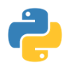

<h1>Hey👋 It's Ractor</h1>

 
- 😄 I'm a student who is interesting in computer science 
- ⚡ Fun fact: I'm interest cybersecurity and abit about AI which more dynamic than a fix programmng can do, yet I'm still beginner 
- 🌱 I’m currently learning django
<!---
minnn098/minnn098 is a ✨ special ✨ repository because its `README.md` (this file) appears on your GitHub profile.
You can click the Preview link to take a look at your changes.
- 👀 I’m interested in ...
- 🌱 I’m currently learning programming lanuages
- 💞️ I’m looking to collaborate on ...
- 📫 How to reach me ...
- 😄 Pronouns: ...
--->
<h1>Lanuange and skill</h1>

  
  
  
  
  

